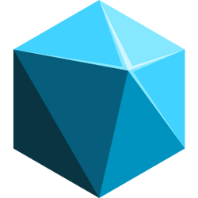

  

# It's time to level up

 Repositorio destinado à organização de todas as edições das NLWs que participei.

---

  <a href="#-sobre">Sobre</a> &nbsp;&nbsp;&nbsp;|&nbsp;&nbsp;&nbsp;
  <a href="#explorer">Explorer</a> &nbsp;&nbsp;&nbsp;|&nbsp;&nbsp;&nbsp;
  <a href="#ignite">Ignite</a> &nbsp;&nbsp;&nbsp;|&nbsp;&nbsp;&nbsp;

---

# 📌 Sobre
  NLW é um evento online e gratuito de programação onde construímos um projeto inédito com muita prática e desafios. Esse evento foi desenhado para levar todos os participantes para o próximo nível.

  A NLW é um evento que dura 5 dias e é uma ótima oportunidade para desenvolver projetos que propões soluções do mundo real.

  O lema aqui é #neverstoplearning

# Explorer
  

    
    explorer
  

  Essa trilha é dedicada pra quem tem pouco tempo de estudos e deseja dominar as bases. Eu gosto de participar, pois sempre aprendo algo novo.

  | Edition | Project | Preview |
  | --- | --- | --- |
  | [nlw-SETUP](./explorer/nlw-SETUP/) | habits | --- |

---

# Ignite
  

    
    explorer
  

  Essa trilha é pra quem já domina os fundamentos e deseja desenvolver uma aplicação de ponta a ponta. Minha trilha favorita.

  | Edition | Project | Preview |
  | --- | --- | --- |
  | --- | --- | --- |

