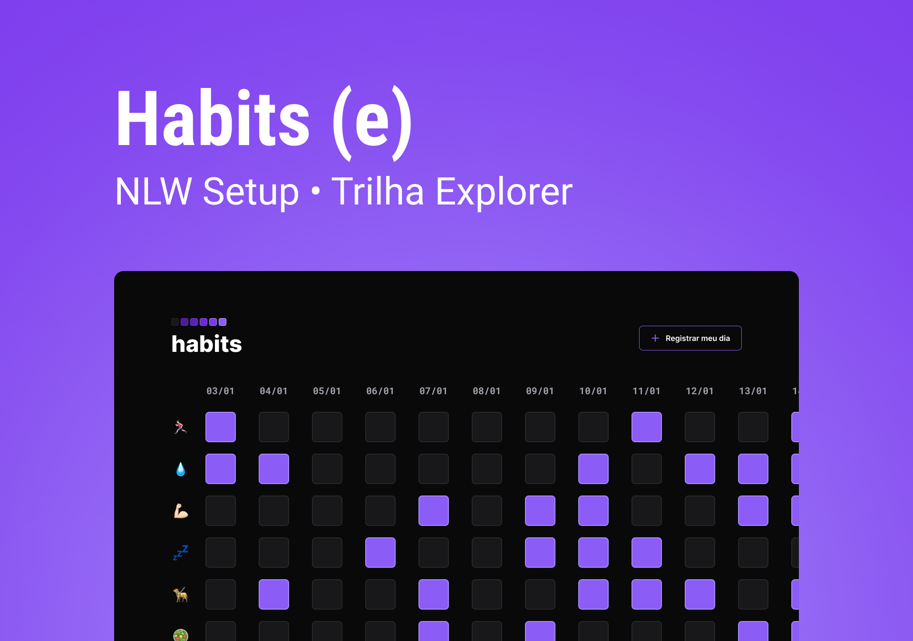

  <!--  -->
     
   

---

  <!-- <a href="https://nlw-esports-explorer-lucianakyoko.netlify.app/">Link</a> &nbsp;&nbsp;&nbsp;|&nbsp;&nbsp;&nbsp; -->
  <a href="#-missions">Missions</a> &nbsp;&nbsp;&nbsp;|&nbsp;&nbsp;&nbsp;
  <a href="#-preview">Preview</a> &nbsp;&nbsp;&nbsp;|&nbsp;&nbsp;&nbsp;
  <a href="#-tecnologies">Tecnologies</a>

---

## 🚀 Missions

  ✔️ concluded &nbsp;&nbsp;&nbsp;|&nbsp;&nbsp;&nbsp;
  ⚫ not started &nbsp;&nbsp;&nbsp;|&nbsp;&nbsp;&nbsp;
  🔵 in progress &nbsp;&nbsp;&nbsp;|&nbsp;&nbsp;&nbsp;
  🔶 paused &nbsp;&nbsp;&nbsp;|&nbsp;&nbsp;&nbsp;
  🔴 abandoned 

| Stage | Content | checklist |
| --- | --- | --- |
| Abertura | live | ✔️ |
| Aula 1 | Primeiros passos | ✔️ |
| Aula 2 | Descomplicando o código | ⚫ |
| Aula 3 | O poder do JavaScript | ⚫ |
| Aula 4 | Profissionalizando o projto | ⚫ |
| Aula 5 | O próximo nível | ⚫ |
| Encerramento | live | ⚫ |

## 🎉 Preview

## 🔨 Tecnologies